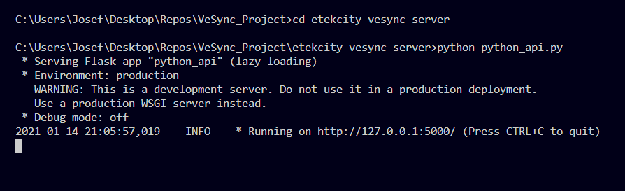
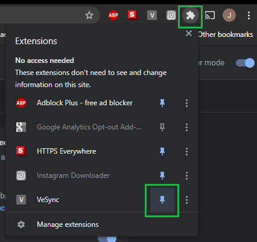
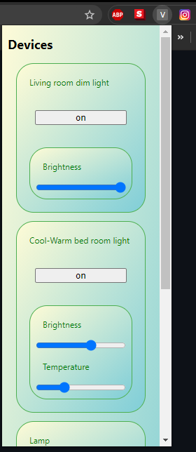
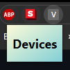

# VeSync Chrome Extension


## Introduction

The initial purpose of this chrome extension is to be able to control the Etekcity Voltson Smart WiFi Outlet (7A model ESW01-USA). 

The project has two parts:

1. **etekcity-vesync-server** - a REST API server that runs locally on the client machine and uses the [pyvesync 1.2.1 module](https://pypi.org/project/pyvesync/) to communicate with the Smart Outlets registered to the account.

2. **vesync-chrome-extension** - a popup chrome extension that shows the smart outlets on the users account when it is clicked. The pop up creates a button for each device. If the device is a dimmable light, it also has either both a light temperature slider and a brightness slider, or just a brightness slider. 

## Supported Devices

This project currently only supports three devices: Etekcity Smart LED Cool-to-Warm White Light Bulb **(ESL100CW)**, Etekcity Voltson Smart WiFi Outlet **(7A model ESW01-USA)**, and Etekcity Smart LED Soft White Dimmable Light Bulb **(ESL100)**.

## Setting up the Python API server

### You're Going to Need Python

Nuff said. Go [download it](https://www.python.org/).

### PyVesync

Once you have python installed install the PyVesync module with:

```bash
pip install pyvesync
```

PyVesync is a library that manages VeSync compatible devices. To learn more about PyVesync, visit the projects [home page](https://github.com/markperdue/pyvesync).

### Create a VeSync account

To be able to use the python API server, you will need to create an account using the [VeSync App](https://www.vesync.com/app) for IOS or Android. 

### Adding your credentials

Create a new file called *vesync_credentials.ini* inside of the *etekcity-vesync-server* folder. Then open the file and paste in the following. Replace the values of the email and password fields with your email and password for the VeSync app. 

```ini 
[credentials]
email = <replace with email>
password = <replace with password>
```

### Starting the Python API

In your terminal of choice 🤓, change directory into the etekcity-vesync-server folder, ```cd etekcity-vesync-server``` and run the script with ```python python_api.py```.



The server should start up and be ready to take and make requests.

## Installing the Chrome Extension

Open up Google Chrome and go to the [extension](chrome://extensions/) page. Then select Load unpacked and select the *vesync-chrome-extension* directory. The chrome extension named **VeSync** should now be installed.



You can pin the VeSync extension by clicking on the **extensions icon > navigate down to VeSync > clicking on the pin**.

## Using the Extension



If you have devices registered to your account, you will see them listed in the popup. If no devices are listed, make sure that the python_api.py script is running.

